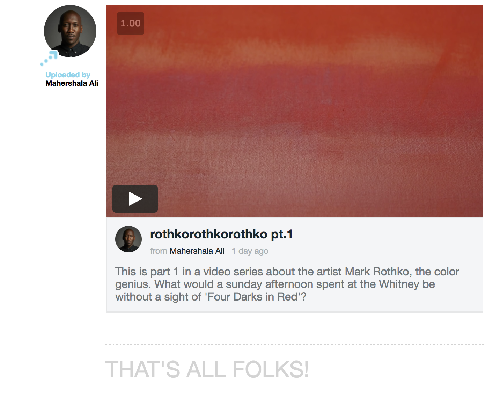

<p align="center">
  
</p>

***

Video is an online video platform where users can upload, edit, and watch videos on a custom-built
HTML5 video player. User experience centers on the feed feature, which displays videos from followed accounts.

[Live Site](https://a-video.herokuapp.com/#/)

## Technology
Video is a single-page-application that utilizes a Rails v5.1.5 back end (connected to a PostgreSQL database)
and a React-Redux v.5.6.0 front end. Video and thumbnail upload is handled by the Paperclip gem,
which in turn uses the Paperclip Transcoder gem to transcode videos using the powerful FFMPEG audio-visual transcoder.
Uploaded videos, background videos, and user icons, are stored on the cloud via Amazon Web Services' S3.

## Features
With a strong emphasis on not relying on external code sources,
Video implements the core features of an online video provider (OVP). It handles back end and front end authentication,
without the use of external libraries. Its upload feature allows users to view video thumbnails and add descriptions and titles.
Its "home-rolled" feed and custom video player are distinguishing features.

#### Feed


The feed displays one of two collections of videos at a time: followed users' videos, and the user's own videos. The collection of followed videos displays multiples of three videos at a time, and a "load more videos" button loads three more videos until the user
contains no more new followed videos.


This pagination scheme does not use an external gem; rather, it relies on a custom-designed interaction between the front end's redux store, and the backends videos controller.


 When the feed page first mounts or when the user clicks "load more videos", the front end dispatches a "requestFeedVideos" AJAX request that contains the requested page number as a parameter.


```javascript
// frontend/util/video_api_util.js
export const fetchFeedVideos = pageNumber => (
  $.ajax({
    method: 'GET',
    url: `/api/videos/feed/${pageNumber}`
  })
);
```
In the backend, the `pageNumber` is multiplied by `FEED_VIDEO_COUNT` (which is set to 3) to determine how many videos to send back in its response. The videos are then sorted by time of upload (a video's id number corresponds to upload time). Take note of the `@number_of_feed_videos` instance variable!

```ruby
# app/controllers/api/videos_controller.rb
def feed_index
  current_user_feed_videos = current_user.followed_videos
  @number_of_feed_videos = current_user_feed_videos.length

  slice_idx = params[:request_counter].to_i * FEED_VIDEO_COUNT
  @videos = current_user_feed_videos.sort_by{|vid| -1 * vid.id}[0...slice_idx]

  if @videos
    render "api/videos/feed"
  else
    render json: { users: {}, videos: {} }
  end
end
```

Now, the most difficult part of this feature is having the front end video list component know that there are no more feed videos, and it should therefore no longer display a "Load More Videos" button, but display a "That's all folks!" message instead.
At first, I tried to rely solely on my front end by checking to see how many videos were in the previous render and compare them to the incoming number of videos. But this approach didn't work because you could navigate away from the feed page, navigate back, and trigger the truth condition-- the number of videos on the previous render was, say, 6 and when you navigated back it was still 6, so the component would not render the load button.

To solve this, I sent up the `@number_of_feed_videos` through my `api/videos/feed` jbuilder to the frontend. I created a feed reducer that listens for a `RECEIVE_FEED_VIDEOS` action, and updates both the `nextFeedPage` and `numberOfFeedVideos` parameters. Now, in my `video_list` component, the logic is quite simple.



```javascript
// frontend/components/video_list/video_list.jsx
componentWillReceiveProps(nextProps) {
  const { numberOfFeedVideos }  = this.props;
  if (nextProps.videos.length === numberOfFeedVideos) {
    this.setState({ noMoreVideosText: true });
  }
}
```

#### Custom Video Player
<p align="center">
  
</p>
The video player does not use the native HTML5 video tag's controls. Rather, it's custom styled and makes use of HTMLMediaElement functionality to implement play-pause, progress bar, and skip-ahead features. It displays the control bar when the video has not started, or when the user mouses over the video, and it updates the progress bar's width at an interval of 10ms.

The skip-ahead feature was difficult to implement because I had to sync the `<video>` HTMLElements `currentTime` attribute to the
`<progress>` bar's CSS width.

To achieve this, I set a React Ref (`videoEl`) on the `<video>` element, `<progress>` element, and `progressBarContainer` div element. By setting the ref on the `<video>` element I'm able to access the video's `duration` and `currentTime` attributes.
On a progress bar click event, the `skipAhead` function is called, and it pauses the video, calculates the new width, sets the new video current time, sets the new width on the progress bar (expressed as a percentage), and then plays the video.

```javascript
// frontend/components/video_player/control_features/progress_bar.jsx
skipAhead(e) {
  const { videoEl } = this.props;
  if (videoEl.ended || videoEl.paused) videoEl.play();
  videoEl.pause();
  const newWidth = this.calculateNewWidth(e.pageX);
  videoEl.currentTime = newWidth * videoEl.duration;
  this.setState({ width: newWidth })
  videoEl.play();
}
```


The trickiest problem is how to calculate the new width percentage based on a user's click position. The formula for the new width is rudimentary: `newWidth = (cursorPosition - progressBarLeftPosition) / totalWidth`, where `progressBarLeftPosition` is the progress bar's
offset from the left side of the viewport, and the total width is the width of the progress bar container (a div element that wraps around the progress element). But how do you get the values of these three variables?

 Well, you have to get into the nitty gritty of DOM element position attributes. First, the cursorPosition is given by `e.pageX`, which is passed in as a parameter. Second, `getBoundingClientRect` calculates the position of the progress bar from the left of the viewport. Third, find the `offsetWidth` on the `progressBarContainer`. I kept getting incorrect pixel measurements because I was finding the `offsetWidth` on the `progressBar`, whose width is always a fraction of the total width!

```javascript
// frontend/components/video_player/control_features/progress_bar.jsx
calculateNewWidth(cursorPosition) {
  const { progressBar, progressBarContainer } = this.state;
  const progressBarLeftPosition = progressBar.getBoundingClientRect().left
  const totalWidth = progressBarContainer.offsetWidth;
  return (cursorPosition  - progressBarLeftPosition) / totalWidth;
}
```
